# 本文未掲載の補足図

本ページには、ICA2026論文のページ制約により最終本文から外した図を収録しています。削減前の完全版原稿で実際に採用していた図だけを対象とし、内部テスト図、旧版図および重複図は除外しました。

感応度分析は年80分割のスクリーニング計算、基準ケースと制約診断は月次480分割の計算です。MVS結果は、非凹性、離散化および較正に依存する探索的結果であり、特定のレジーム閾値を確定するものではありません。

## 1. 終端分布と制約診断

### 1.1 各戦略の終端富密度

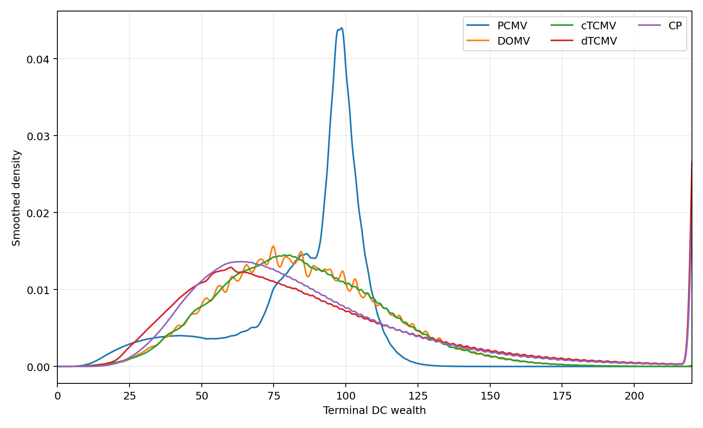

共通平均較正後の終端富分布を密度で比較しています。PCMVはターゲット近傍への集中が強く、分布中央の鋭い山として現れます。一方、dTCMVは分布が広く、右裾への参加を残す形です。CDFだけでは見えにくい「どこに確率質量が集中しているか」を確認するための補足図です。右端の小さな山には上端格子への確率質量が含まれるため、裾の絶対水準は境界診断と併せて解釈する必要があります。

### 1.2 上限制約が拘束する確率質量

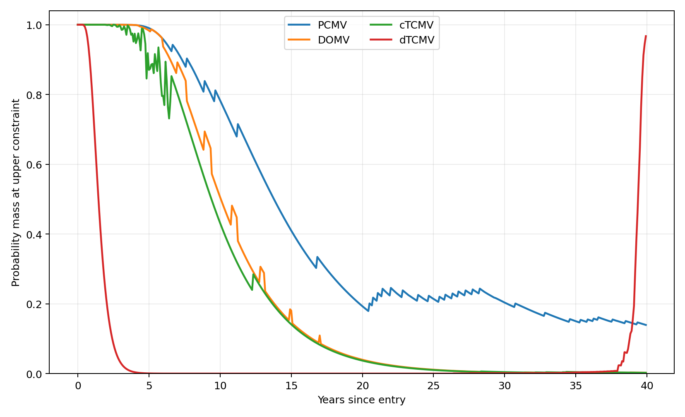

各時点で、リスク資産投資額の上限制約、すなわち現在のDC残高を全額リスク資産へ投資する条件が拘束する確率質量を示します。加入初期は将来拠出に比べて現在残高が小さいため、複数の最適戦略で上限制約が拘束しやすくなります。dTCMVでは中間期間の拘束確率が急速に低下する一方、退職直前には状態依存的に再上昇します。これは単純な年齢依存の右下がり運用ではないことを示しています。

### 1.3 上限制約の自由境界

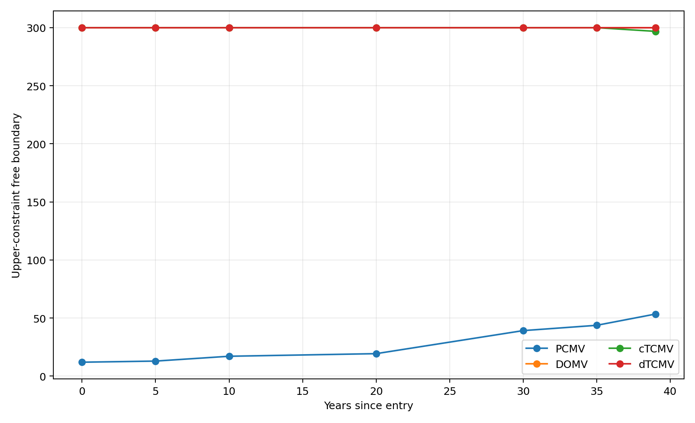

全額リスク資産が選択される領域と内部解の領域を分ける数値的自由境界を、代表時点ごとに示します。PCMVの境界は満期へ向けて上昇し、DOMVはおおむね一定水準で推移します。cTCMVの境界も時間とともに上昇しますが、dTCMVの上限制約領域は主として低残高側に限定されます。dTCMVがリスクを取らないという意味ではなく、内部領域では総年金富に応じてリスク配分を変えることを意味します。

### 1.4 時点別の射影誤差

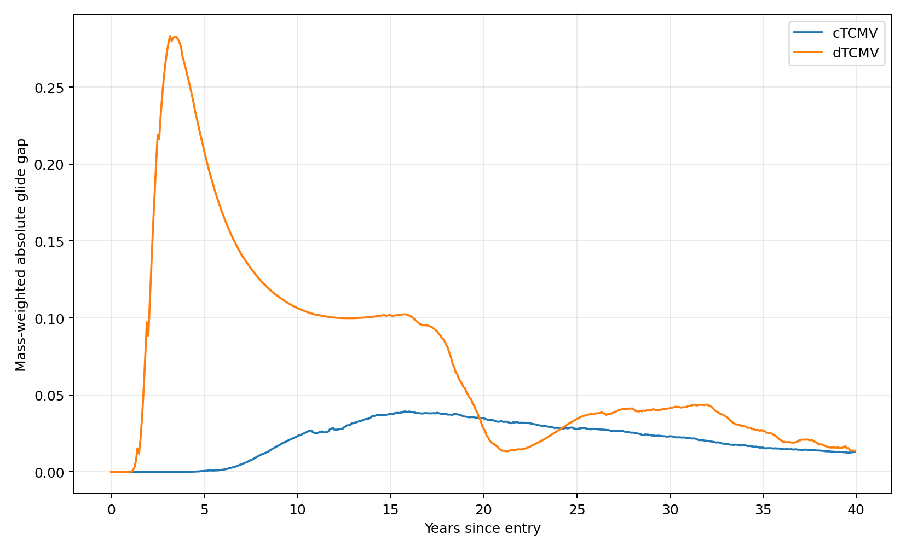

cTCMVおよびdTCMVについて、制約付き問題を直接解いた厳密解と、無制約解を事後的に区間へクリップした近似との差を確率質量で加重しています。dTCMVでは加入初期から中期にかけて差が大きく、単純なクリップが状態依存の自由境界を十分に再現しない期間があります。退職時点へ近づくと差は縮小しますが、クリップ近似を厳密解と同一視できることを意味するものではありません。

## 2. ローリング条件付き評価

### 2.1 全戦略のローリング評価

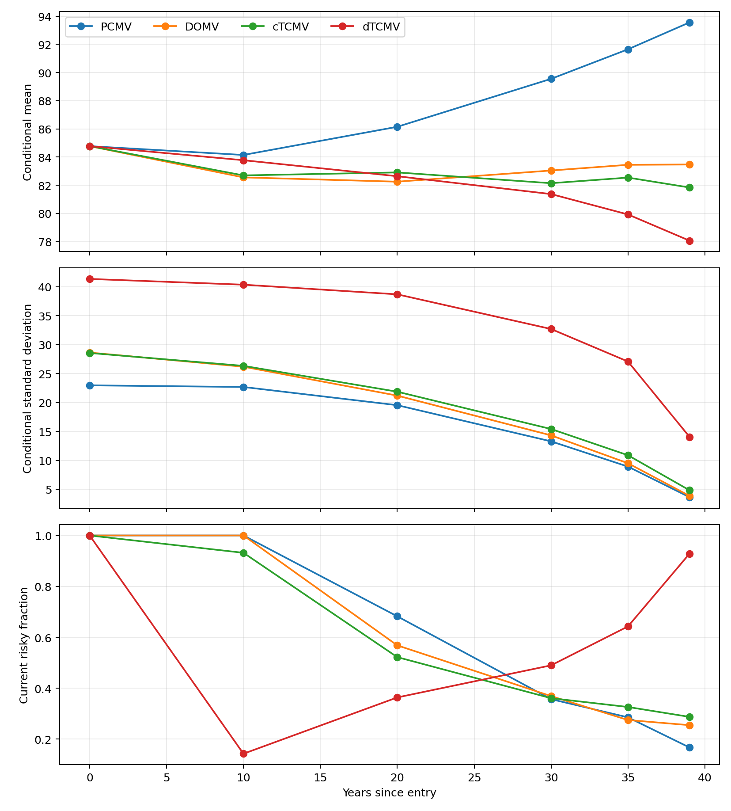

各戦略が自ら生成する中位残高状態を新たな開始点とし、その時点から同じフィードバックを継続した場合の条件付き終端平均、条件付き標準偏差および現在のリスク資産比率を示します。PCMV、DOMVおよびcTCMVでは、残存期間の短縮に伴ってリスク量がおおむね低下します。dTCMVは中間時点でリスク比率を落とした後、実現残高と残存期間に応じて退職前に再び引き上げます。この挙動が、dTCMVを単純な年齢依存グライドパスと区別します。

## 3. グライドパスの感応度分析

以下の5図は、低残高領域を細かくした格子を用いる年80分割のスクリーニング分析です。結果の方向性と頑健性を確認するための補足資料であり、包括的な格子収束証明ではありません。

### 3.1 DB給付 \(D_T\) に対する感応度

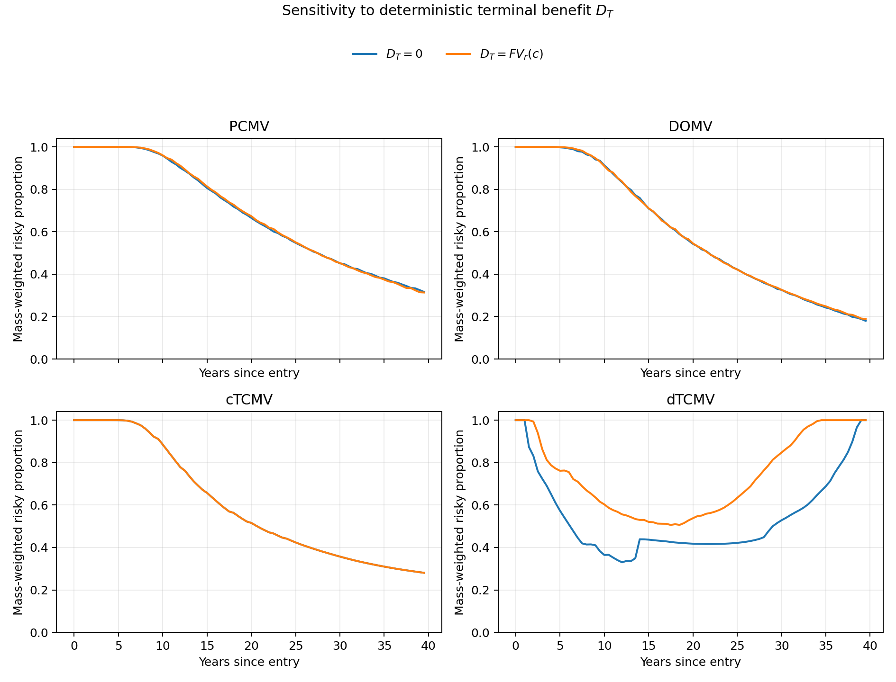

PCMV、DOMVおよびcTCMVでは、確定的なDB給付を加えてもDC部分の最適グライドパスはほぼ重なります。これらの問題では、確定的給付が目的関数の定数項または平行移動として作用するためです。これに対し、総年金富依存のdTCMVではDB給付が有効なリスク回避度に影響し、グライドパスの水準とU字形状が変化します。

### 3.2 安全利子率 \(r\) に対する感応度

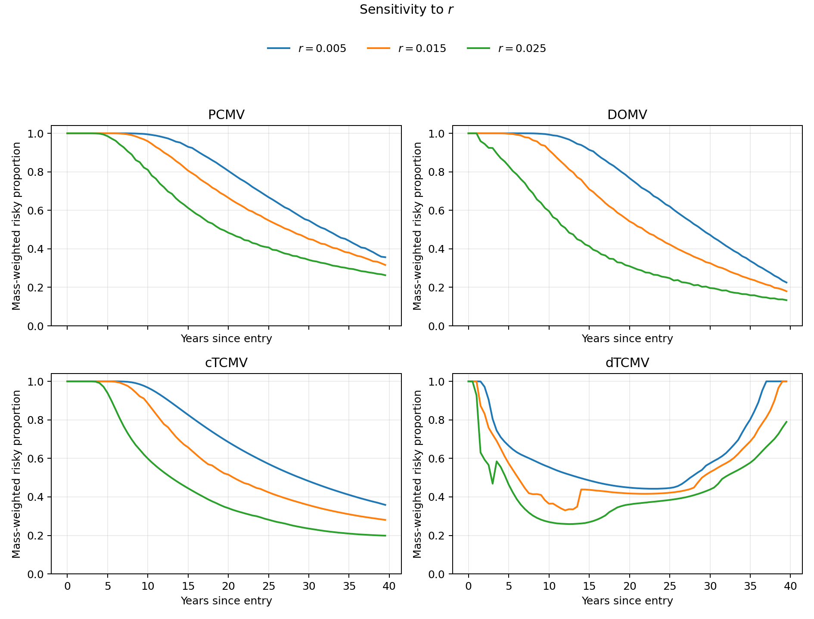

基準値は \(r=0.015\) です。安全利子率が高いほど、安全資産のみでも将来富を積み上げやすくなるため、PCMV、DOMVおよびcTCMVのリスク資産比率は全般に低下します。dTCMVでも中間期間のリスク比率が低下しますが、退職前の再上昇を含む状態依存形状は残ります。

### 3.3 リスク資産期待収益率 \(\mu\) に対する感応度

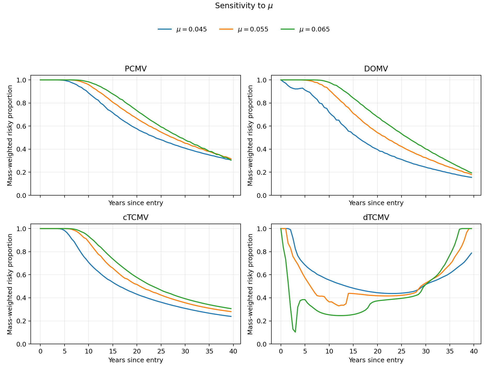

基準値は \(\mu=0.055\) です。期待超過収益が高くなるほど、PCMV、DOMVおよびcTCMVではリスク資産を保有する便益が高まり、リスク比率が上昇します。dTCMVでも水準は変化しますが、低残高時の上限制約と総年金富依存のリスク回避度が同時に作用するため、応答は単純な平行移動にはなりません。

### 3.4 リスク資産ボラティリティ \(\sigma\) に対する感応度

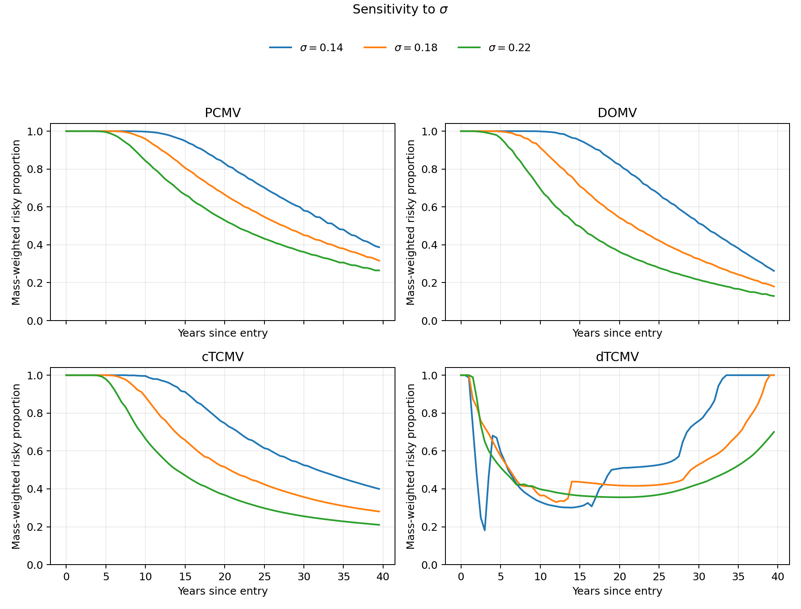

基準値は \(\sigma=0.18\) です。ボラティリティの上昇は分散費用を高めるため、各戦略のリスク資産比率をおおむね低下させます。dTCMVでは中間期間の谷と退職前の再上昇が残り、パラメータを変えても状態依存的な形状が維持されることが確認できます。

### 3.5 拠出プロファイルに対する感応度

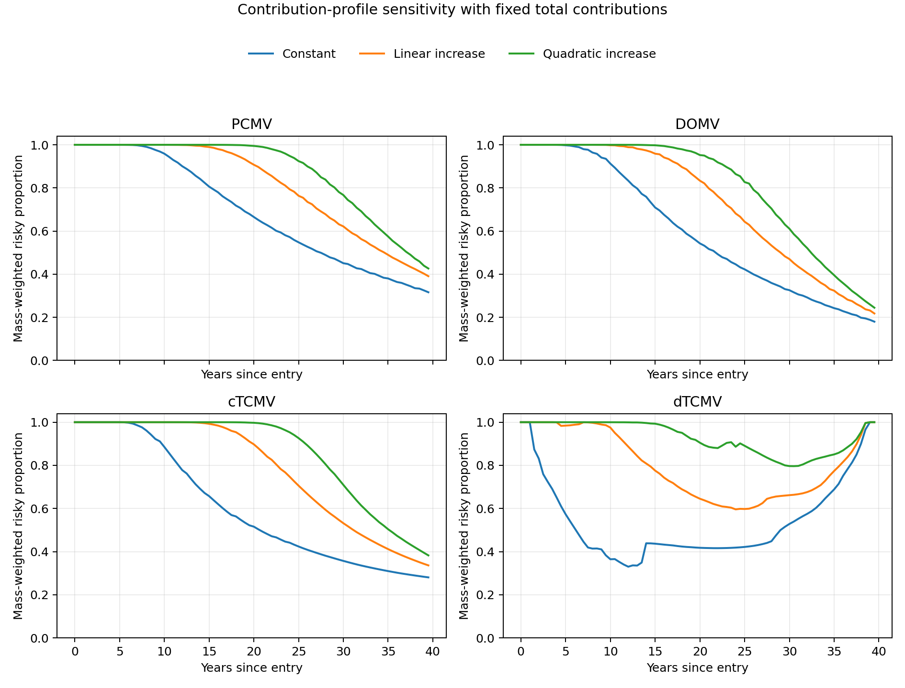

総拠出額を同一に保ち、一定拠出、線形増加および二次的増加を比較しています。拠出を後半へ寄せるほど、加入初期の人的資本、すなわち将来拠出の現在価値が大きくなるため、初期から中期のリスク資産比率が高くなります。総拠出額だけでなく拠出の時期も最適グライドパスを左右することを示しています。

## 4. PCMV--MVS・DOMV--MVSの探索的結果

### 4.1 再較正後のグライドパス

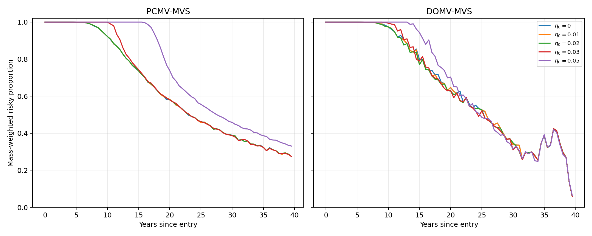

歪度係数 \(\eta_0\) を変化させたPCMV--MVSとDOMV--MVSのグライドパスです。小さい係数ではMV解とほぼ重なりますが、係数が一定水準を超えるとPCMV--MVSのリスク取得時期が大きく変わります。DOMV--MVSの変化は相対的に小さいものの、終盤には離散化に伴う変動も見られます。

### 4.2 再較正後の終端CDF

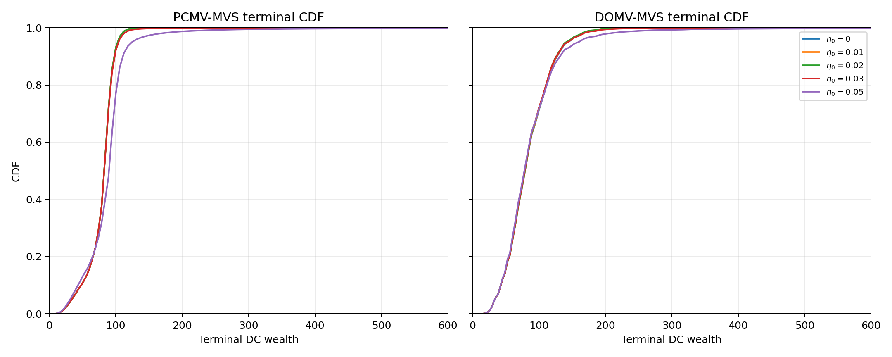

小さい歪度係数では終端CDFもMV基準とほぼ一致します。係数を大きくすると、特にPCMV--MVSで分布形状の変化が現れます。ただし、中心部分のCDFが近く見えても、第三モーメントは極端な上方裾に強く反応するため、分布全体が同一であるとは限りません。

### 4.3 MVS係数に対する非線形応答

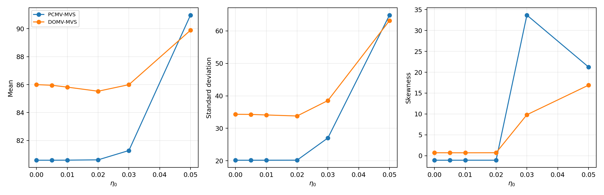

平均、標準偏差および歪度の \(\eta_0\) に対する応答をまとめています。小さい係数では変化が限定的ですが、中程度以上では平均・標準偏差・歪度が非線形に変化し、数値的なレジーム転換が観察されます。この閾値は制御格子、状態格子、ターゲット探索および補間に依存し得るため、実務上の確定値ではなく探索的な結果として解釈します。

## 5. dTCMV--MVSの詳細

### 5.1 分散回避係数を固定したグライドパス

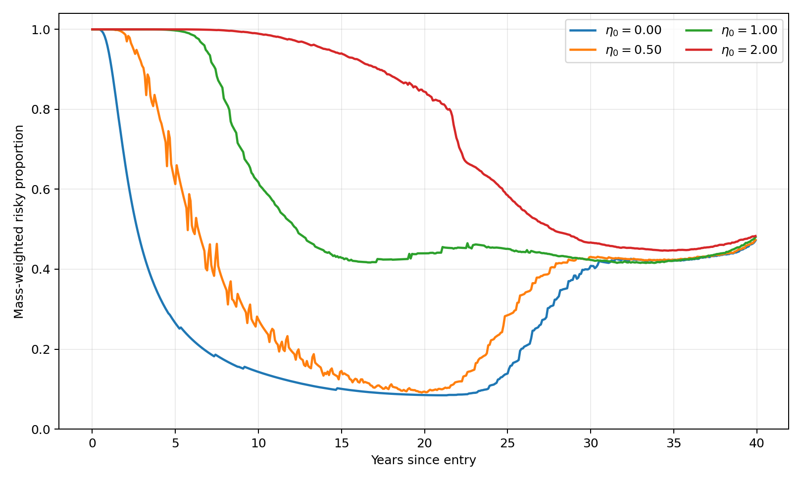

分散回避係数 \(\gamma_0=2.5\) を固定し、歪度係数だけを変化させています。歪度選好を強めると、単に全期間のリスク比率が上がるのではなく、リスクを取る時期が後方へ移動し、中間期間の谷と退職前の再上昇が組み替わります。

### 5.2 共通平均較正後のグライドパス

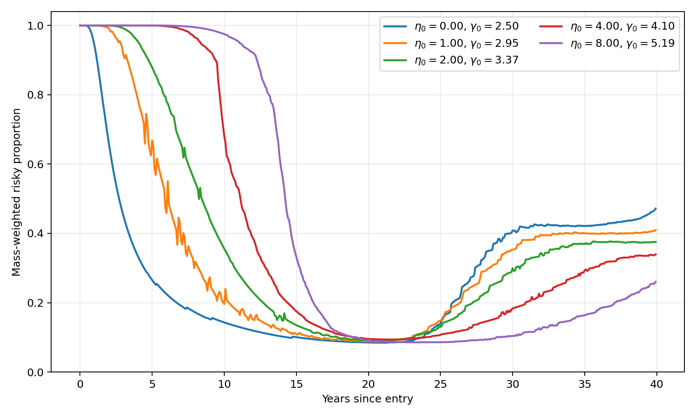

各MVS戦略の平均終端富をMV基準へそろえるように分散回避係数を再較正した比較です。平均水準を固定してもグライドパスは一致せず、MVS係数に応じてリスク取得時期が変化します。したがって、MVSの効果は平均の上昇だけでは説明できません。

### 5.3 共通平均較正後の終端CDF

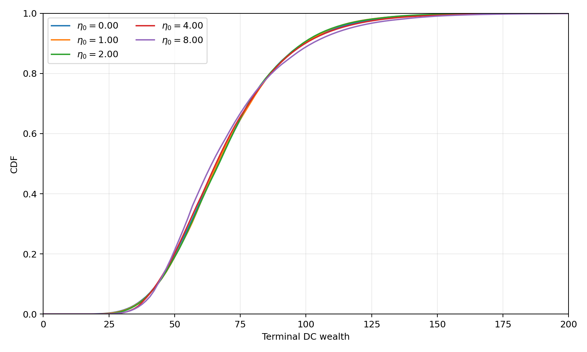

平均をそろえた場合の終端CDFです。分布中央では曲線が近い一方、下方・上方の裾で差が残ります。平均が同じでも、分散、下方リスク、上方参加および歪度の組合せが異なることを示しています。

### 5.4 下方・上方裾のフロンティア

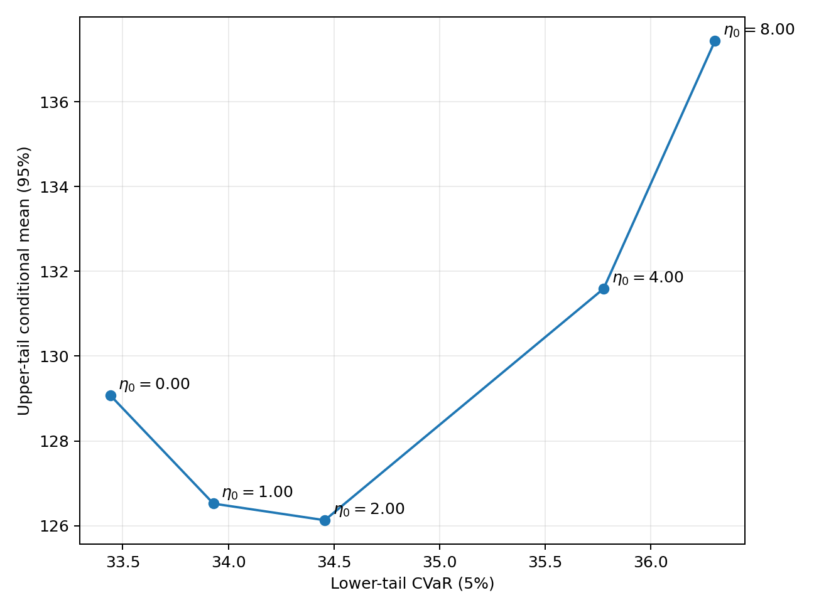

横軸は下方5%のCVaR、縦軸は上方5%の条件付き平均です。中程度の歪度係数では下方リスクを改善しながら上方裾がいったん抑制され、さらに係数を高めると右裾参加が再び強まります。歪度選好の強化が単調な「高リスク・高リターン化」ではなく、裾の配分を非線形に変えることを示します。

### 5.5 ローリング条件付き指標

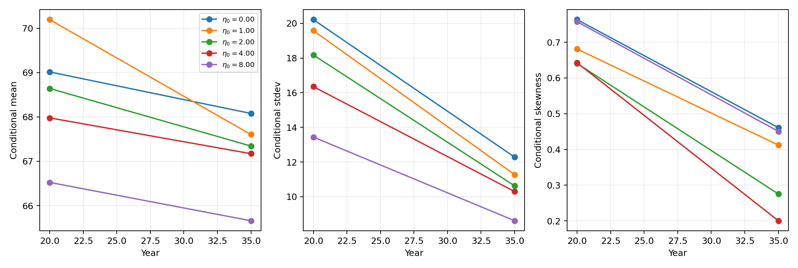

20年時点と35年時点の中位残高状態から再評価した条件付き平均、条件付き標準偏差および現在のリスク資産比率です。歪度係数を高めると、両時点で条件付き標準偏差と現在のリスク比率が低下する場合があります。MVSが一律に積極化するのではなく、全期間の右裾形成と将来時点のリスク抑制を組み合わせることを示しています。

## 解釈上の共通注意

- 感応度図は年80分割のスクリーニング結果であり、基準ケースの月次480分割結果とは時間格子が異なります。
- 厳密制約解とクリップ近似は別の解です。両者が近い図でも、理論上同一であることを意味しません。
- MVSは三次モーメントを含むため非凹性を伴い、極端な上方裾、格子幅、制御候補および補間に敏感です。
- 図中のレジーム転換や数値閾値は探索的結果であり、包括的な収束分析を経た実務較正値ではありません。
